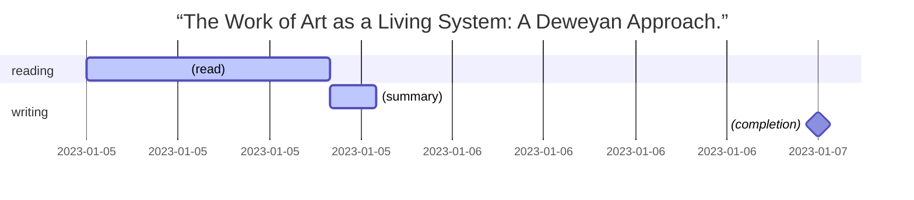

# 2023-01-05

[mermaid syntax](https://mermaid.js.org/syntax/gantt.html)

## Readings

- Polenta, Stefano. “The Work of Art as a Living System: A Deweyan Approach.” _Phenomenology of the Object and Human Positioning_, edited by Calley A. Hornbuckle et al., vol. 122, Springer International Publishing, 2021, pp. 203–22. DOI.org (Crossref), https://doi.org/10.1007/978-3-030-66437-4_13.
  - 

## chores

  - 18:20:81 pm
  - [yonggeun.github.io](https://yonggeun.github.io) repository made.
  - 2023-01-06